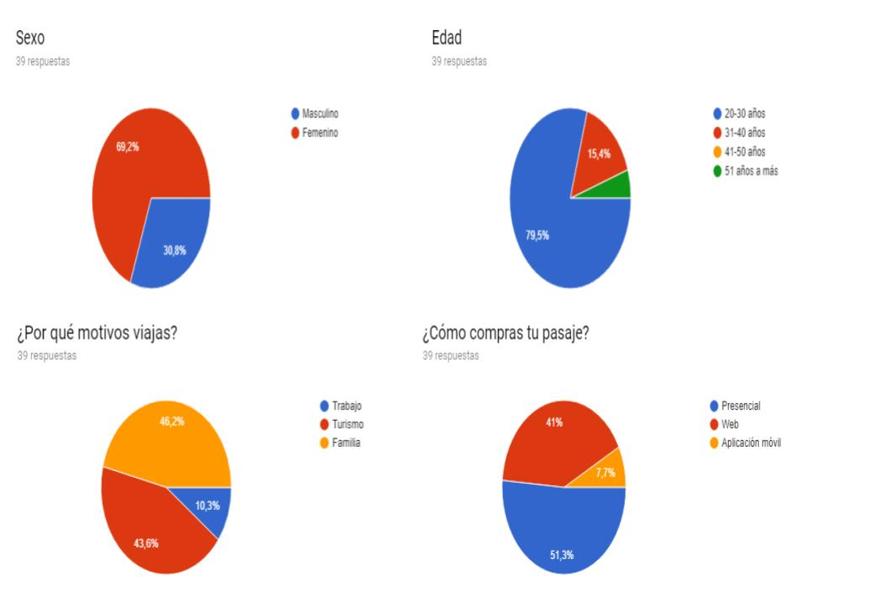
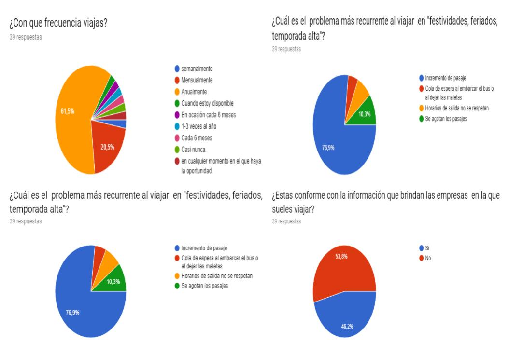
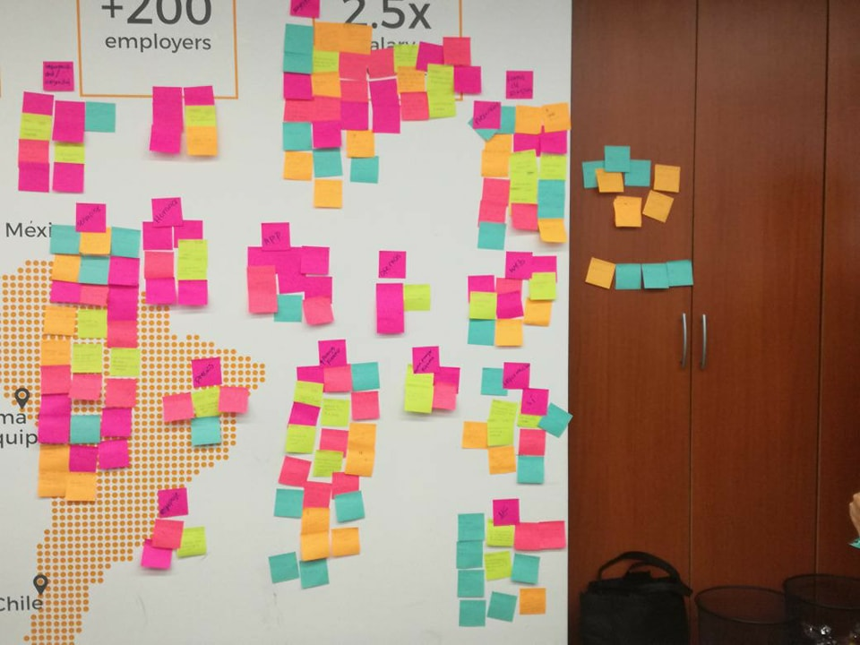
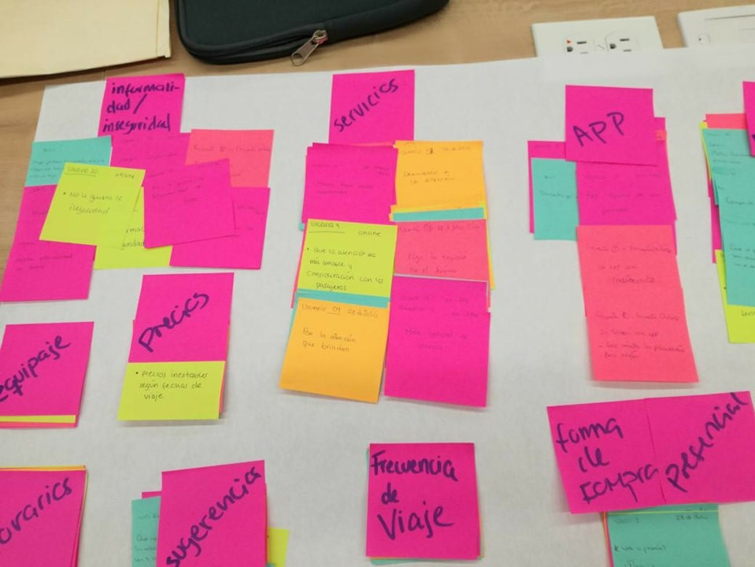
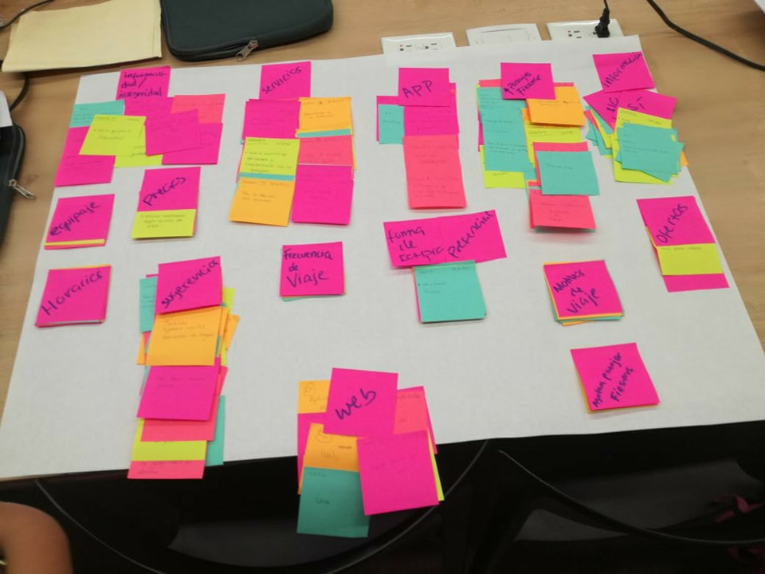
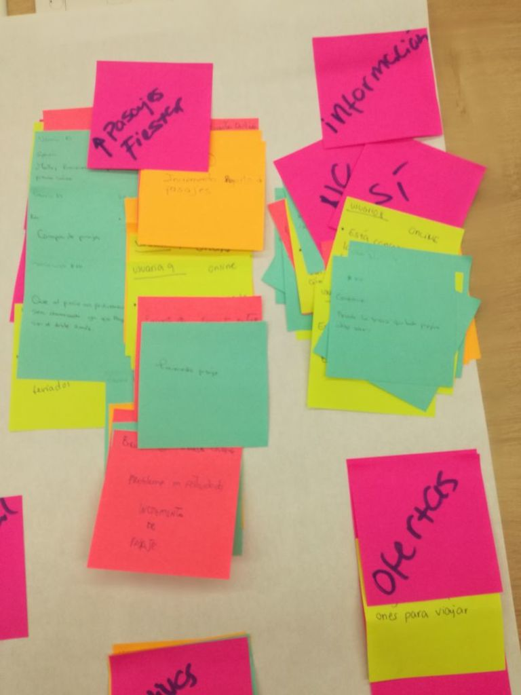

# **RETO UX : NUEVA EXPERIENCIA EN EMPRESAS DE BUSES**  

>Track: Common Core.  
Unidad: Primer proyecto Ux.  

### **Planteamiento del problema**  
Nos ha contactado Catalina una emprendedora viajera con una idea de negocio. Durante sus últimas vacaciones Catalina estuvo viajando por todo latinoamérica. Durante estos viajes Catalina tuvo que tomar muchos buses de todo tipo para llegar a ver los paisajes más lindos del continente. Durante sus viajes Catalina se dio cuenta que existen aún muchas oportunidades para mejorar la experiencia de todos los usuarios de este tipo de transporte: horarios, embarques, desembarques, compra de tickets en los terminales, compra de tickets online, cancelaciones, cambios de pasajes, etc. Adicionalmente, Catalina se dio cuenta que todas las plataformas de venta de tickets de bus tienen cosas por mejorar en Chile, Perú y México.  

*Dado este contexto.*

→ **¿Cómo hacer para crear un producto que mejore la experiencia en empresas de buses?**  

### **Planificación**  
  
#### Día 1 :
  - Planificación del trabajo.  
  - Planteamiento de preguntas a usuarios.
    - 10 Preguntas (Online/Presencial).

#### Día 2 :  
- **Ux Research** : Entrevistas a usuarios.  

  - Horario de encuentro del grupo para la entrevista 9:00am.  
  - Primer punto de la entrevista Av.Javier Prado,empresa Movil Tours y Cruz del Sur.(2p)  
  Segundo punto de la entrevista Av.28 de Julio diversas empresa de transporte.(3p)  
  - Participamos todas.  
  - 20 Personas a entrevistar aproximadamente.  

-  **Análisis de Usuario**  : Analizando la información recaudada.

    - Punto de encuentro Laboratoria 12:00pm para reunir todas la información recaudada.
    - Realizar un mapa de afinidad o lluvia de ideas para detectar las necesidades del usuario.
    - Investigar empresas del mismo rubro.  

#### Día 3 :  
-  **Mapa de afinidad**
      - Realizar un mapa de afinidad o lluvia de ideas para detectar las necesidades del usuario.
      - Priorizar y decidir qué problemática vamos a abordar.  
      - Hacer un benchmark y buscar referencias relacionadas a el problema.  

#### Día 4 :
- **Presentacion del problema** : Presentacion en clase y feedback del problema a tratar.
    - Explicación de los temas encontrados en el diagrama de afinidad.  
    - ¿Cómo priorizaron y seleccionaron el problema de su squad?  
    - Presentación del problema a abordar.  

#### Día 5:  
- **User personas y Brainstorming**
    - Crear un user persona para entender mejor las metas, deseos y limitaciones de los principales grupos de usuario de nuestro producto.  
    - Elaborar los problem statements del caso ya que nos ayudaran a centrarnos en resultados y no en productos.  
    - Escribir HMW y what if? para asi entender mejor los problemas y desarrollar mejores hipótesis.  
    - Hacer una lista de funcionalidades que pueden resolver los HMW.  
- **Definir el MVP**
    - Priorizar lista de features y definir el MVP.  
    - Hacer un storyboard y recivir feedback.  

#### Día 6:
- **Testeo**
     - Hacer un content prototype.  
     - Testearlo en pareja con compañeras de otro scuad.

## **ENTENDIENDO LAS NECESIDADES DEL USUARIO.**

#### Día 2

## **Encuestas presenciales.**

  

- Entrevistamos a 26 personas de entre 22 y 60 años para evaluar sus necesidades.
- Localización:
   - Punto 1: Av. Javier Prado Este – Lima: Agencias de Transporte Terrestre.
   - Punto 2: Av.28 de Julio –La Victoria: Agencias de Transporte Terrestre.
- Grabamos las entrevistas de los usuarios para centrarnos en el lenguaje corporal.  

### **Preguntas:**

1. ¿Alguna experiencia buena o mala con los servicios que ofrece
 la empresa de buses?

2. ¿A su parecer cuál es el mayor problema que tienen las empresas de transporte (Embarque, Desembarque, Compra de pasajes, Cambio de boletos u otros inconvenientes)?  

3. ¿Qué es lo que más se le dificulta al momento de elegir su horario de viaje?

4. ¿Por qué motivos viaja?

5. ¿Cómo elige en que empresa viajar?

6. ¿Qué tan sencillo consideras el proceso de reserva de pasajes en la empresa de buses?

7. ¿Con qué frecuencia viaja?

8. ¿Cuál es el presupuesto que invierte en la compra de su pasaje?

9. Usted compra sus boletos de manera presencial o vía web?

10. ¿Cuál es el problema más recurrente al viajar en festividades?¿

#### **Respuesta de uno de los entrevistados:**

  -  *Viajo por motivos familiares.*   
  - *Siempre viajo por confianza.*  
  - *Separo mi boleto de manera presencial.*  
  - *Aproximadamente 100 soles.*  
  - *El precio se incrementa de los pasajes.*

#### **Segun las encuestas que realizamos el 60% de las personas nos indican que desean :**  

- Rapidez en la venta de pasajes.  
- Que la empresa de buses en la que viajaran sea cómoda y económica.  
- Habilitar mas pasajes y mas buses por que no se dan abasto.   
- Eligen a la empresa en la que viajaran por que hay mucha seguridad.  
- Eligen a la empresa de buses en la que viajaran por ser conocida y recomendada.

## **Encuestas on-line.**
Se encuesto a 39 personas de entre 20 a 52 años para averiguar sus necesidades así como también los problemas más frecuentes al viajar en bus.

  

#### Día 3 :  

-  **Diagrama  de afinidad**

Se desarrolló el análisis de las encuestas realizadas para poder recopilar toda la información y los problemas encontrados.

Empleamos el **Diagrama de Afinidad** para poder identificar  y clasificar los diversos problemas encontrados.

Se consideró clasificar los problemas por temas.

Por ejemplo :

 Servicios, frecuencia de viaje, formas de pago, precios, etc.

El trabajo previo permitió encontrar el problema más común.

- El incremento de los pasajes en festividades y la falta de información.

**continuara...**
#### Día 4 :
